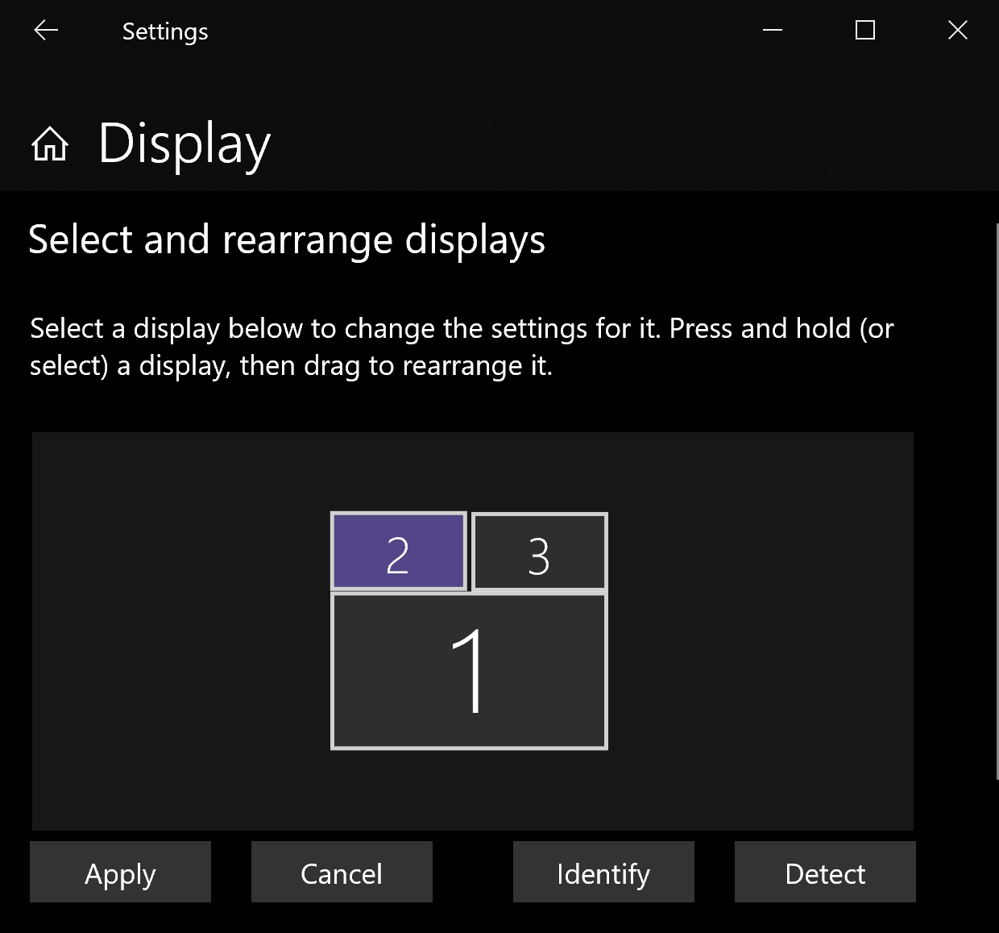
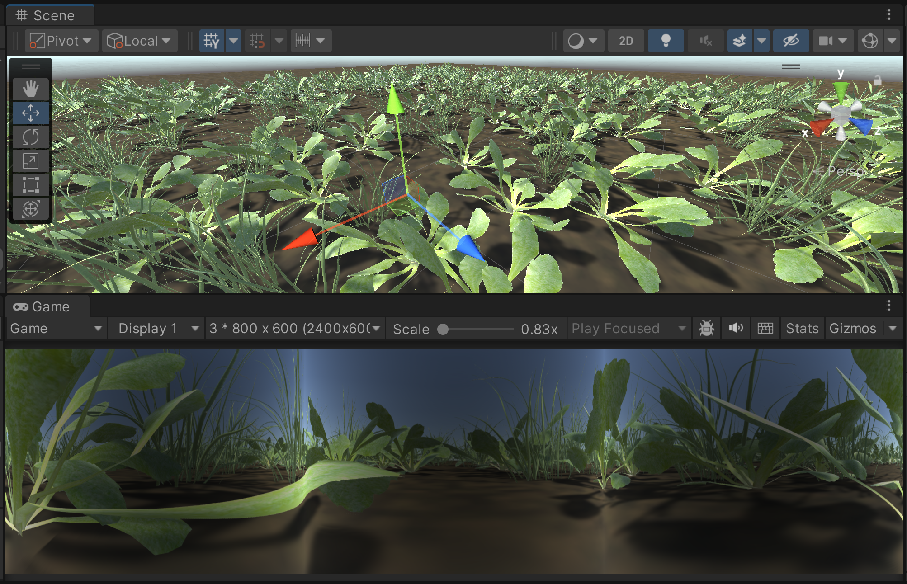

# Janelia Camera Utilities

## Summary
This package (org.janelia.camera-utilities) implements various utilities related to cameras.  For example, there is code to implement [off-axis perspective projection using the approach of Robert Kooima](http://csc.lsu.edu/~kooima/articles/genperspective/).

## Installation
Follow the [installation instructions in the main repository](https://github.com/JaneliaSciComp/janelia-unity-toolkit/blob/master/README.md#installation).


## Details

### `Janelia.OffAxisPerspectiveCamera`

Makes the attached camera use off-axis perspective projection.

### `Janelia.AdjoiningDisplaysCamera` and `Janelia.AdjoiningDisplaysCameraBuilder`

Unity supports ["multi-display"](https://docs.unity3d.com/Manual/MultiDisplay.html), with a game having multiple cameras each shown on its own external display monitor.  Framerates above 60 Hz are not possible, though (as of 2019).

The `Janelia.AdjoiningDisplaysCamera` script implements an alternative with higher performance.  It combines the multiple camera images into one wide image that is associated with another, main camera.  The associated `Janelia.AdjoiningDisplaysCameraBuilder` builds a standalone executable with the special options to make the main camera's wide image extend across all the external displays, putting the appropriate part on each display.

To use `AdjoiningDisplaysCamera` on Windows:

1. Connect the external displays so they are numbered `2` through `N` in the Windows "Display Settings".  It is best if `2` is the left-most, and then the display numbers increase in order.  But if such an arrangement is not possible, see step 7., below.

<p align="center">

</p>

2. In the "Display Settings", give each display the appropriate resolution (e.g., 1920 horizontal and 1080 vertical).  The resolution must be the same for all displays, and they must have the same "Orientation".

3. In the "Display Settings", make sure the "Multiple displays" fields says "Extend desktop to this display" (not "Duplicate desktop").

4. In the Unity editor, add the `AdjoiningDisplaysCamera` script to one camera, such as the standard `Main Camera`.  The "Target Display" for this camera should be "Display 1".

5. Open `AdjoiningDisplaysCamera`'s "Display Cameras" section, set the "Size" field to the number of external displays, and set "Element `i`" to the camera for external display `i+1` (because the first "Element" is `0` but the first external display is `1`).

6. Set `AdjoiningDisplaysCamera`'s "Display Width" and "Display Height" fields to match the external display resolution from step 2.

7. If the left-most display in the Windows "Display Settings" is not `2`, then use its number as the value for the `AdjoiningDisplaysCamera`'s "Left Display Index" field.

8. To build the standalone executable, use the menu item "File/Build and Make Adjoining-Displays Shortcut", which triggers code in `AdjoiningDisplaysCameraBuilder`.  When the build is complete, it adds a shortcut file, `standalone`, to the Unity project's root folder.  This shortcut runs the executable with the necessary [command line arguments](https://docs.unity3d.com/Manual/CommandLineArguments.html) to make the wide image extend onto all the external displays (i.e., `-popupwindow -screen-fullscreen 0 -monitor 2`)

When the game is running, it can display a _progress box_, a small square that alternates between black and white with each frame (so a photodiode attached to an oscilloscope can give an accurate indication of the frame rate).  
- Pressing the `c` key changes which display shows the progress box.
- Pressing the `p` key changes which corner of that display contains the progress box, with the fifth press hiding the progress box altogether.

Also, pressing the `m` key toggles mirroring of the displays on and off (useful for back-projected displays).

### Frame Packing

For animal participants who can see very fast changes (e.g., the _Drosophila_ fruit fly), the `Janelia.AdjoiningDisplaysCamera` supports an optional way of improving the visual smoothness through "frame packing" for DLP (digital light processing) projectors.   When ready to render frame _i_ at time _t\_i_, `AdjoiningDisplaysCamera` interpolates the camera pose (position, orientation) at three fractions of the interval from _t\_i-1_ to _t\_i_, and renders the scene at each fraction.  It then packs the resulting image from each fraction into one color channel of the image that is finally displayed.  [A DLP displays each color channel successively](https://www.benq.com/en-us/business/resource/trends/dlp-and-3lcd-projectors.html) for a fraction of the overall frame time, so the net effect is that the images for the interpolated camera poses are visible as frames at a higher frame rate to animals capable of seeing at the higher rate.  The higher-rate frames appear in grayscale instead of color, but that is acceptable in some applications.

The Unity Editor's Inspector gives control over what the three fractions are, and what color channel corresponds to each fraction.  The fractions are controlled with three 0-to-1 sliders.  What color channel corresponds to each fraction is controled by a "packing order" value; a packing order of "GRB", for example, indicates that the first fraction corresponds to the display of green, the second fraction to red and the third to blue.

Note that while frame packing increases effective frame rate and smoothness, it does _not_ reduce latency.  In fact, it actually increases the latency by roughly the time to draw one frame.

### Panoramic Display on Non-Flat Screens

The `Janelia.PanoramicDisplayCamera` script supports displays that are not traditional flat surfaces. Supported alternatives include a cylindrical display surface surrounded by a ring of projectors, "back projecting" the panorama visible to a subject moving freely inside the cylinder. This script sets up a box of cameras pointing out from the subject, and then remaps those camera views to the format needed by the projectors in real time using the GPU.

The `Janelia.ExampleUsingPanoramicDisplayCamera` script shows how to set up the data needed for a cylindrical display, which is passed to `PanoramicDisplayCamera` with its `SetDisplaySurfaceData` function. The tracking of the freely moving subject (e.g., using computer vision) must be implemented separately.

The curvature of a display surface like a cylinder may distort the brightness of the projected image (e.g., reducing the brightness at the borders between projectors, since those areas have more of an angle away from projector light source). A compensating texture (e.g., with a reduction factor applied away from the borders between projectors) can be passed to `PanoramicDisplayCamera`. The following image shows the effect for three projectors, with the compensation exagerated for emphasis; note that there are three regions across the image with gradual lightening at the edges of each region.

<p align="center">

</p>


This compensating texture can be generated with the `Janelia.CameraUtilities.SetupCylinderProjectorEdgeBrightener` function, which computes computes the brightness attenuation with [Lambert's cosine law](https://en.wikipedia.org/wiki/Lambert%27s_cosine_law); it also includes a user-defined scale factor, that can be changed interactively to match the conditions of particular display surface. See the `ExampleUsingPanoramicDisplayCamera` script. An alternative is to write a custom function to generate the compensating texture, using the `CameraUtilities.SetupCylinderProjectorMaskDelegate` API.

Screen curvature can also distort the color near the borders between projectors, so `PanoramicDisplayCamera` also takes a color correction texture. This correction texture can be generated with the `Janelia.CameraUtilities.SetupCylinderProjectorEdgeColorCorrector` function, which also uses the cosine law and includes user-defined parameters for the color to correct and for scaling.

Like `AdjoiningDisplaysCamera` described above, `PanoramicDisplayCamera` generates a single image that adjoins the images for each projector horizontally. To use this image on Windows, go to the Windows "Display Settings and arrange the projectors in order, left to right; then the image can extend across all the projectors, with the appropriate part on each projector.

There are some constraints on the projectors and the cylindrical screen, so that projectors with a specified (horizontal) field of view can cover a cylinder of a specified radius with the adjoined images. The `PanoramicDisplayCamera.SetDisplaySurfaceData` function computes and prints out these constraints as it runs, so they appear in either the Unity editor console, or the `Player.log` text file, from the
[place where Unity stores its logs](https://docs.unity3d.com/Manual/LogFiles.html). Example output is:
```
Please position projector 0 at (-9.97, 0.00, -5.76)
Please position projector 1 at (0.00, 0.00, 11.52)
Please position projector 2 at (9.97, 0.00, -5.76)
Please make the cylinder 5.100435 units tall.
```


Using a display surface other than a cylinder involves calling `PanoramicDisplayCamera.SetDisplaySurfaceData` with custom arrays that describe where the pixels of the projectors map to 3D positions on the display surface. Custom arrays are also useful for a cylindrical display surface if there is to be regions of overlap between the images from adjacent projectors.
