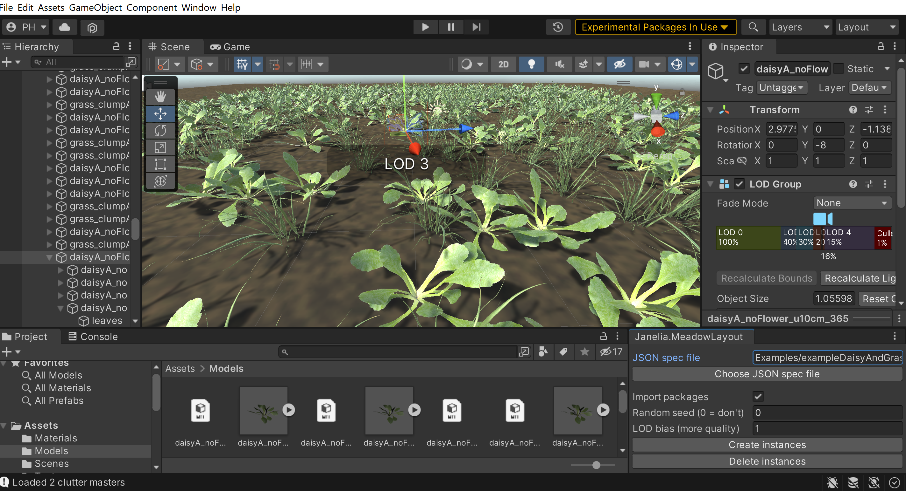

# Janelia Meadow Generator

## Summary

This package (org.janelia.meadow) arranges plant models in a "meadow" according to high-level specifications.  The densities of each plant type, and other details affecting the arrangement, are described in a "spec" file in the [JSON format](https://en.wikipedia.org/wiki/JSON).  

## Installation

Follow the [installation instructions in the main repository](https://github.com/JaneliaSciComp/janelia-unity-toolkit/blob/master/README.md#installation).

## Details

### User Interface

Installing the package causes the Unity editor's `Window` menu to have the "Layout Meadow" item.  Choosing this item creates a panel with buttons for building a meadow.  One button launches a file dialog for choosing the JSON spec file.  Another button creates a meadow from the chosen spec file; note that it first deletes any existing meadow, and it also reloads the spec file to get any recent edits.  Another button deletes the meadow without creating a new one.

The panel has several additional controls that affect the meadow creation:
* "Import packages": when checked, creating a meadow forces a new import of the asset packages for the plants, in case they have changed.
* "Random seed (0 = don't)": a non-0 seed is re-applied each time a meadow is generating, giving repeatable results.
* "LOD bias (more quality)": a value above 1 causes [LODs (geometric levels of detail)](https://docs.unity3d.com/Manual/LevelOfDetail.html) to change more conservatively, improving quality at the expense of performance.

### JSON Spec File

The generation of a meadow involves the random placement of plants on a ground plane (parallel to the _x-z_ plane).  Purely random placement could look too "clumpy", with large areas having no plants.  So the approach is to divide the ground into a regular grid, and then place one plant per cell with "jitter" (a random displacement from the cell center, giving what could be seen as a form of [stratified sampling](https://en.wikipedia.org/wiki/Stratified_sampling)).

The plants placed in these cells are known as "clutter" for historical reasons.  Future versions may add support for plants in other roles, like "skyline" trees at the edges of the meadow.  For the purposes of experiments conducted so far, collision detection with the clutter plants is not important, and is not implemented.

The JSON spec file contains elements to control the grid,  the random placement within grid cells, and other parameters:

* `"xWidth10cm"` [required]: The overall size of the meadow in the _x_ dimension.  Note that one unit is 10 cm, which is different from the Unity standard of one unit being 1 m; the new units give a better compromise between higher resolution and lower numerical instability at the scale of small animals (e.g, _Drosophila_ fruit flies).
* `"zWidth10cm"`[required]: The overall size of the meadow in the _z_ dimension, with one unit being 10 cm.
* `"xWidthClear10cm"` [optional, default 0]: The overall size in the _x_ dimension of a clear space with no plants at the center of the meadow.  The default of 0 means there is no clear space.
* `"zWidthClear10cm"` [optional, default 0]: The overall size in the _z_ dimension of a clear space with no plants at the center of the meadow.
* `"xNumClutterCells"` [required]: The number of cells along the _x_ dimension.
* `"zNumClutterCells"` [required]: The number of cells along the _z_ dimension.
* `clutterJitterFraction"` [optional, default: 0.3]: Controls the "jitter" or random displacement from the cell center, with 0 giving no jitter and 0.5 giving the most possible jitter.
* `"clutterItems"`: [required] An array of items, each specifying one type of plant that can be used as clutter.
  * `"lods"`: [required] An array of items, specifying the [levels of detail (LODs)](https://docs.unity3d.com/Manual/LevelOfDetail.html) for the current type of plant.  The first LOD in the array should represent the plant with the most detail, with detail decreasing with later positions in the array.
    * `"pkgFilePath"` [required]: The file system path to the asset package (`.unitypackage` file) containing the mesh and textures for this LOD.  A path can be relative to the directory containing the JSON spec file, or absolute.
    * `"minScreenHeight"` [required]: When the plant's height occupies less than this fraction of the rendered image's height, then the next (lower resolution) LOD in the array is used.  So to _increase quality_, use a _smaller value_ here (i.e., the next LOD, which is lower resolution, will not be used until this plant is further from the camera), and to _increase performance_, use a _larger value_ here (i.e., the next LOD, which renders more quickly, will be used when this plant is closer to the camera).
  * `"probability"` [required]: The probability that this type of plant will be chosen to be used in a cell.  If the probabilities of all the plant types do not sum to one, then a cell may have no plant at all.
* `"groundColor"` [optional, default: `"#2E2516"`]: The color of the ground plane under the plants.
* `"groundGlossiness"` [optional, default: 0.1] The glossiness or [smoothness](https://docs.:unity3d.com/Manual/StandardShaderMaterialParameterSmoothness.html) of the ground plane.
* `"groundTextureFilePath"` [optional, default: ""]: The file system path to the image file to be used as texture on the ground plane.  The path can be relative to the directory containing the JSON spec file, or absolute.
* `"ambientColorHDR"` [optional, default: [0.211, 0.227, 0.258] ]: The HDR (high dynamic range) color of the ambient light in the scene.  The color is an array of floating point values rather than a CSS color string to allow components greater than one.
* `"ambientIntensity"` [optional, default: 0.8]: The HDR intensity of the ambient light.  Its value corresponds to what can be set in the Unity editor as follows: from the "Window" menu, choose "Rendering" and then "Lighting"; in the resulting dialog, choose the "Environment" tab; in the "Environment Lighting" section, click on the "Ambient Color" control; in the resulting dialog, there is an "Intensity" slider near the bottom.

Unlike traditional JSON, comments lines starting with `//` or `#` are allowed, and are removed before the file is processed.  Not all structured text editors handle JSON with comments, but [Visual Studio Code](https://code.visualstudio.com) does, when the "Select Language Mode" control in the bottom right is changed to "JSON with Comments".

## Examples

The `Examples` folder contains several example JSON spec files, that work with the asset packages in the `Plants` folder.  In addition to the color versiosn of the plants, there are also grayscale versions, which are more appropriate for the _Drosophila_ visual system.